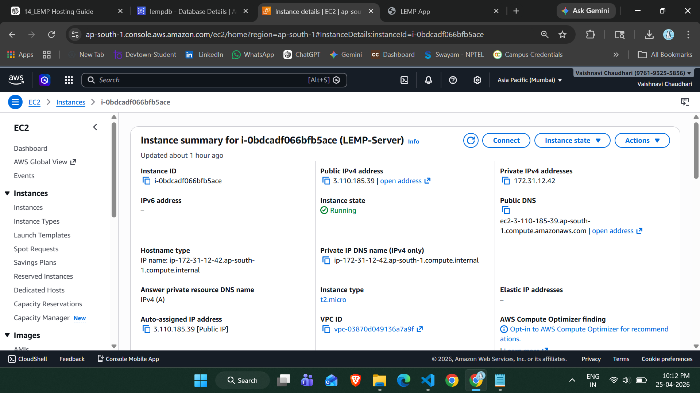
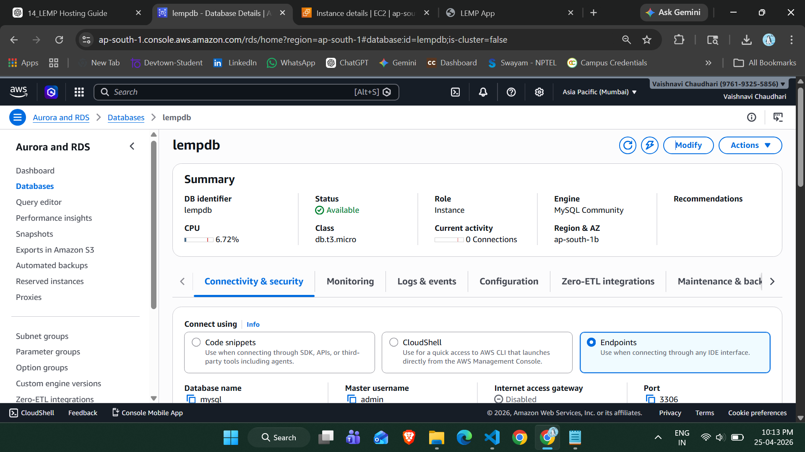
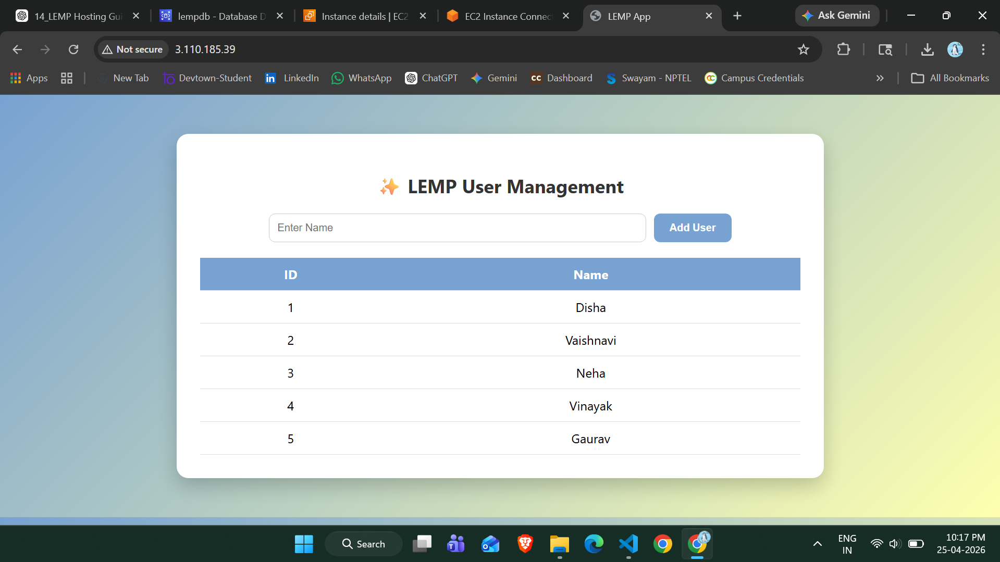

# 🚀 LEMP Stack Application Hosting on AWS

## 📌 Project Overview

This project demonstrates deployment of a **LEMP Stack Web Application** on AWS cloud.

**LEMP = Linux + Nginx + MySQL + PHP**

The application is hosted on an EC2 instance using Nginx and PHP, and connected to a MySQL database hosted on Amazon RDS.

---

## 🎯 Features

* ➕ Add new users
* 📋 View users from database
* ❌ Delete users
* 🌐 Hosted on AWS Cloud
* 🎨 Attractive UI with modern design

---

## 🧰 AWS Services Used

* **Amazon EC2** → Hosting web server (Linux + Nginx + PHP)
* **Amazon RDS** → MySQL database

---

## 🏗️ Architecture

User → Browser → EC2 (Nginx + PHP) → RDS (MySQL)

---

## ⚙️ Step-by-Step Implementation

---

### 🔹 Step 1: Launch EC2 Instance

* OS: Ubuntu 22.04
* Instance Type: t2.micro (Free Tier)
* Security Group:

  * Port 22 (SSH)
  * Port 80 (HTTP)

📸 EC2 Instance:


---

### 🔹 Step 2: Connect to EC2

```bash
ssh -i your-key.pem ubuntu@your-public-ip
```

---

### 🔹 Step 3: Install Nginx

```bash
sudo apt update
sudo apt install nginx -y
sudo systemctl start nginx
sudo systemctl enable nginx
```

---

### 🔹 Step 4: Install PHP

```bash
sudo apt install php-fpm php-mysql -y
```

---

### 🔹 Step 5: Create Project Directory

```bash
sudo mkdir /var/www/lemp
sudo chown -R $USER:$USER /var/www/lemp
```

---

### 🔹 Step 6: Configure Nginx

```bash
sudo nano /etc/nginx/sites-available/lemp
```

Paste configuration:

```nginx
server {
    listen 80;
    server_name _;

    root /var/www/lemp;
    index index.php index.html;

    location / {
        try_files $uri $uri/ =404;
    }

    location ~ \.php$ {
        include snippets/fastcgi-php.conf;
        fastcgi_pass unix:/var/run/php/php8.3-fpm.sock;
    }
}
```

Enable configuration:

```bash
sudo ln -s /etc/nginx/sites-available/lemp /etc/nginx/sites-enabled/
sudo rm /etc/nginx/sites-enabled/default
sudo nginx -t
sudo systemctl restart nginx
```

---

### 🔹 Step 7: Create RDS Database

* Engine: MySQL
* DB Name: lempdb
* Instance: db.t3.micro
* Public Access: Enabled

📸 RDS Database:


---

### 🔹 Step 8: Allow EC2 to Connect RDS

Add inbound rule in RDS Security Group:

```
Type: MySQL
Port: 3306
Source: 0.0.0.0/0 (for testing)
```

---

### 🔹 Step 9: Connect EC2 to RDS

```bash
mysql -h your-endpoint -u admin -p
```

---

### 🔹 Step 10: Create Database & Table

```sql
CREATE DATABASE lempdb;
USE lempdb;

CREATE TABLE users (
    id INT AUTO_INCREMENT PRIMARY KEY,
    name VARCHAR(50)
);
```

---

### 🔹 Step 11: PHP Application

The application performs:

* Insert data into database
* Display all users
* Delete users dynamically

---

## 🌐 Final Output

📸 Application UI:


---

## 🎯 Key Features

* Fully deployed on AWS Cloud
* Real-time database integration
* Clean UI with CSS styling
* CRUD operations (Create, Read)

---

## ⚠️ Challenges Faced

* Nginx configuration errors
* File permission issues
* MySQL access denied error
* PHP syntax and runtime errors

---

## 💡 Learning Outcomes

* AWS EC2 setup and deployment
* RDS database configuration
* LEMP stack implementation
* Debugging real-world issues

---

## 🚀 Future Enhancements

* ✏️ Update/Edit user feature
* 🔐 Authentication system
* 📱 Responsive mobile UI
* ⚙️ CI/CD pipeline integration

